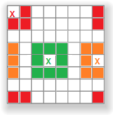

# TDII

El objetivo será ir recopilando las tareas, entregas y trabajos prácticos de forma digitalizada para la materia __**Técnicas Digitales II**__ dictada en la __**Universidad Tecnológica Nacional F.R.B.A**__

## Introducción 🚀

El programa está implementado con la placa de desarrollo [BluePill](https://stm32-base.org/boards/STM32F103C8T6-Blue-Pill.html)

El juego consta de un tablero rectangular, donde cada celda del mismo puede estar viva "1" o muerta "0" y para llegar viva al estado siguiente tiene que cumplir con un conjunto de reglas particular. En nuestro caso el tablero es de 8x8 y las reglas son las de Conway (Conocidas como reglas 23/3):

+ Una celda permanece viva en el siguiente estado si tiene dos o tres celdas vecinas vivas.
+ Una celda "nace" en el siguiente estado si tiene exactamente tres celdas vecinas vivas.
+ Toda celda que no cumple las condiciones anteriores muere (por "soledad" o "superpoblación") en el próximo estado.

El concepto de celda vecina que vamos a utilizar es el siguiente. Son las 8 celdas que rodean a la celda a analizar. Todas las celdas van a tener 8 celdas vecinas, incluídas las de los bordes y los extremos que se van a cerrar sobre los otros bordes.

[Aquí](https://youtu.be/1f65lHXS-TQ) se puede encontrar un video del código en funcionamiento

## Funcionamiento :electric_plug:
+ El patrón inicial está determinado por el mi __**número de  legajo 1680109**__ hasta que el patrón se muere. Luego se genera otro patrón que por la combinación de números implementada queda oscilando para siempre.

## Autor ✒️
* **Tobias Bavasso Piizzi** - *Trabajo Inicial* - [tbavassopiizzi](https://gitlab.frba.utn.edu.ar/tbavassopiizzi)
